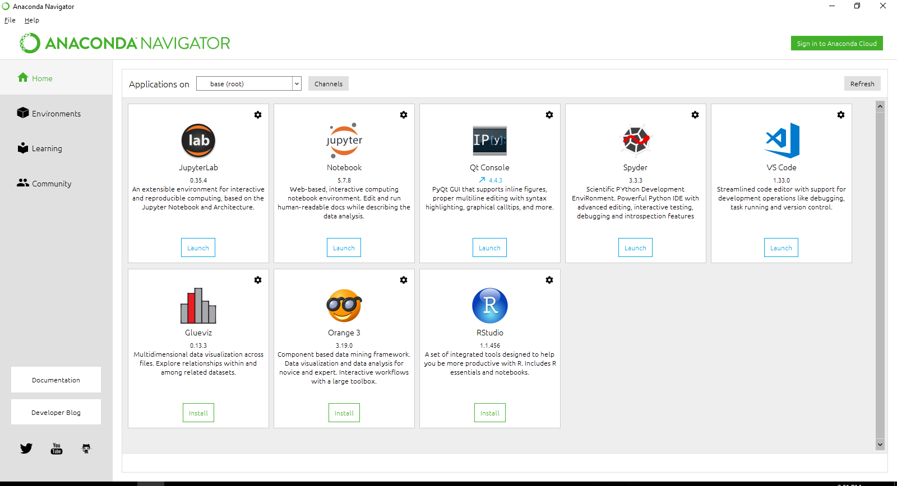

# PROBABILITY AND STATISTICS A/B <!-- omit in toc -->

## Course materials for PROBABILITY AND STATISTICS A/B <!-- omit in toc -->

Teruo Nakatsuma (Faculty of Economics, Keio University, Japan)

---

- [How to set up Python and necessary packages](#how-to-set-up-python-and-necessary-packages)
  - [Step 1: Installing Anaconda](#step-1-installing-anaconda)
  - [Step 2: Creating an environment](#step-2-creating-an-environment)
    - [For Windows users](#for-windows-users)
    - [For macOS/Linux users](#for-macoslinux-users)
    - [Troubleshooting](#troubleshooting)
- [How to start Jupyter Notebook](#how-to-start-jupyter-notebook)
  - [Troubleshooting](#troubleshooting-1)
- [Jupyter Notebooks and related files in `notebook-a`](#jupyter-notebooks-and-related-files-in-notebook-a)
- [Jupyter Notebooks and related files in `notebook-b`](#jupyter-notebooks-and-related-files-in-notebook-b)

---

## How to set up Python and necessary packages

I strongly recommend using [Anaconda](https://www.anaconda.com/). It can install Python along with numerous essential packages at once and allows us to manage those packages flexibly.

### Step 1: Installing Anaconda

1. If you have an older Anaconda on your PC, uninstall it completely by folloiwng [instructions](https://docs.anaconda.com/anaconda/install/uninstall/).

2. Download an Anaconda installer (Windows, macOS or Linux) from [here](https://www.anaconda.com/distribution/). Choose a Python 3 installer.

3. Doubleclick the installer and follow the instructions on the screen. Do not change the default settings.

### Step 2: Creating an environment

---

#### For Windows users

Start `Anaconda Powershell Prompt` (Windows)

```IPython
(base) PS C:\Users\Thomas> conda update conda
```

This will update conda (package manager) in Anaconda. Then type

```IPython
(base) PS C:\Users\Thomas> conda create -n bayes python=3.7 bokeh jupyterlab seaborn spyder nodejs
```

This will create the enviromnemt for PyMC. Then type

```IPython
(base) PS C:\Users\Thomas> conda activate bayes
```

You will notice that the prompt is altered as

```IPython
(bayes) PS C:\Users\Thomas>
```

Then install PyMC via pip.

```IPython
(bayes) PS C:\Users\Thomas> pip install pymc3
```

Finally type

```IPython
(bayes) PS C:\Users\Thomas> python -m ipykernel install --user --name bayes --display-name "Python (Bayes)"
```

Now you are ready for Python!

---

#### For macOS/Linux users

Start `Terminal` (macOS, Linux) and type

```IPython
(base) MacBook-Pro :~ Thomas% conda update conda
```

This will update conda (package manager) in Anaconda. Then type

```IPython
(base) MacBook-Pro :~ Thomas% conda create -n bayes python=3.7 bokeh jupyterlab seaborn spyder nodejs pymc3
```

This will create the enviromnemt for PyMC. Then type

```IPython
(base) MacBook-Pro :~ Thomas% conda activate bayes
```

You will notice that the prompt is altered as

```IPython
(bayes) MacBook-Pro :~ Thomas%
```

Finally type

```IPython
(bayes) MacBook-Pro :~ Thomas% python -m ipykernel install --user --name bayes --display-name "Python (Bayes)"
```

Now you are ready for Python!

---

#### Troubleshooting

When the installing process is failed, you must remove the environment before you try to install it again. To do so, type

```IPython
(base) PS C:\Users\Thomas> conda env remove -n bayes
```

Then redo the installation.

---

## How to start Jupyter Notebook

<!--- ### Method 1: From the command line -->

Start `Anaconda Powershell Prompt` (Windows) or `Terminal` (macOS, Linux) and type

```IPython
(base) PS C:\Users\Thomas> conda activate bayes
```

Then type

```IPython
(bayes) PS C:\Users\Thomas> jupyter notebook --port=8888
```

Your default browser will pop up.

### Troubleshooting

For a bokeh interactive plot to work properly, the Jupyter Notebook server must use `port 8888` which is set by default. In case this port is occupied by another Jupyter Notebook server, you need to stop it by typing

```IPython
(bayes) PS C:\Users\Thomas> jupyter notebook stop
```

before you open a new Jupyter Notebook. If this does not work, reboot your PC.

<!-- Click the `Python (Bayes)` button to create a Jupyter notebook. -->

<!--  -->

<!--- ### Method 2: From Anaconda Navigator

Start `Anaconda Navigator`. You may find it in `Start Menu` (Windows) or `Launchpad` (macOS). Alternatively you just type

```IPython
(base) PS C:\Users\Thomas> anaconda-navigator
```

in `Anaconda Powershell Prompt` (Windows) or `Terminal` (macOS, Linux).

Click the `Launch` button in the `Jupyter Notebook` panel.
-->

<!--  -->

---

## Jupyter Notebooks and related files in `notebook-a`

| file name | description |
|:-------------------------------|:------------------------------------------|
| Dimes.csv                      | weights of a sample of dimes              |
| example_bernoulli.ipynb        | posterior inferernce on Bernoulli dist.   |
| example_normal.ipynb           | posterior inference on normal dist.       |
| example_poisson.ipynb          | posterior inference on Poisson dist.      |
| Housing.csv                    | sales prices of houses                    |
| housing_price.ipynb            | hedonic price model of houses             |
| labor_participation.ipynb      | logit model of labor participation        |
| logit.ipynb                    | PyMC example of logit model               |
| Mroz.csv                       | US women's labor paritication data        |
| poisson_regression.ipynb       | PyMC example of Poisson regression model  |
| probit.ipynb                   | PyMC example of probit model              |
| prussian.csv                   | Prussian army horse kick data             |
| regression.ipynb               | PyMC example of regression analysis       |
| ships.csv                      | ships damage data                         |
| ships_damage.ipynb             | Poisson regression model of ships damage  |
| wage_education.ipynb           | relationship between wage and eduaction   |

---

## Jupyter Notebooks and related files in `notebook-b`

| file name | description |
|:-------------------------------|:------------------------------------------|
| large_sample.ipynb             | consistency and asymptotic normality      |
| markovchian.ipynb              | Markov chain                              |
| probability_distribution.ipynb | examples of probability distributions     |
| python_introduction.ipynb      | simple example of Bayes' theorem          |
| skewness_kurtosis.ipynb        | skewness and kurtosis                     |

---
